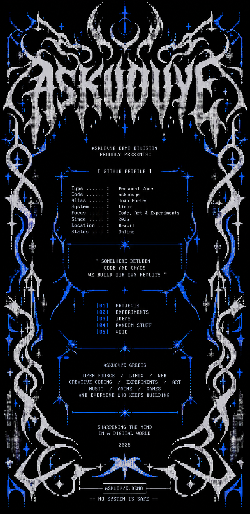

<div align="center">

<a href="https://joaofortes.dev">
  
</a>

<br><br>

<a href="https://joaofortes.dev">
  
</a>
<a href="https://github.com/askuovye">
  
</a>
<a href="https://www.linkedin.com/in/joaolopesfortes/">
  
</a>

</div>

---

```text
ASKUOVYE.DEMO // PROFILE DATA

Type ...... : Developer Profile
Code ...... : João Fortes
Alias ..... : askuovye
Role ...... : Full Stack Developer
Stack ..... : Vue / TypeScript / Laravel
System .... : Linux
Location .. : Brazil
Status .... : ONLINE
Web ....... : joaofortes.dev
```

## // WHO_AM_I

Full stack developer and Software Engineering student from Brazil.

I build applications from database to interface, with a particular interest in the point where **software engineering, interaction and visual identity** meet.

My work tends to mix practical systems with experimental interfaces, retro software references and creative coding.

```text
CURRENTLY
──────────────────────────────────────────────────────────────

BUILDING .... personal projects / strange interfaces
WORKING ..... full stack / freelance
LEARNING .... software engineering
INTERESTS ... web · systems · linux · creative coding
```

## // LOADOUT

### FRONTEND

<p>
  
  
  
  
  
</p>

### BACKEND

<p>
  
  
</p>

### DATABASE

<p>
  
  
</p>

### TOOLS

<p>
  
  
  
  
</p>

## // RELEASES

```text
[01] JOAO.DEV
     type .... personal portfolio
     stack ... Vue / TypeScript / Vite / SCSS
     state ... LIVE
     web ..... joaofortes.dev

[02] VESTOCK
     type .... thrift management system
     stack ... Laravel / Vue / MySQL
     state ... project

[03] ECOLINK
     type .... waste-disposal mapping platform
     stack ... Laravel / PHP / MySQL
     state ... project

[04] ECOLINK MOBILE
     type .... mobile client
     stack ... Flutter / Firebase
     state ... project
```

**[JOAO.DEV](https://joaofortes.dev)** ·
**[PORTFOLIO SOURCE](https://github.com/askuovye/Portifolio)** ·
**[ECOLINK](https://github.com/askuovye/EcoLink)** ·
**[ECOLINK MOBILE](https://github.com/askuovye/ecolinkflutter)**

## // GREETS

```text
ASKUOVYE GREETS

OPEN SOURCE / LINUX / WEB / CREATIVE CODING
EXPERIMENTS / INTERFACES / MUSIC / GAMES
AND EVERYONE WHO KEEPS BUILDING
```

## // TRANSMISSION

<p>
  <a href="https://joaofortes.dev">
    
  </a>
  <a href="https://github.com/askuovye">
    
  </a>
  <a href="https://www.linkedin.com/in/joaolopesfortes/">
    
  </a>
</p>

```text
──────────────────────────────────────────────────────────────

                  SHARPENING THE MIND
                   IN A DIGITAL WORLD

                  ASKUOVYE // 2026

──────────────────────────────────────────────────────────────
```
